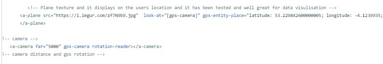
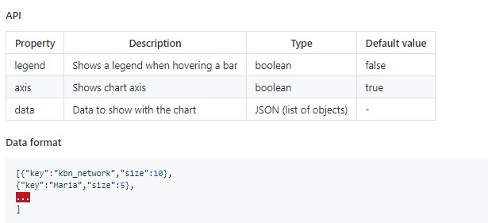
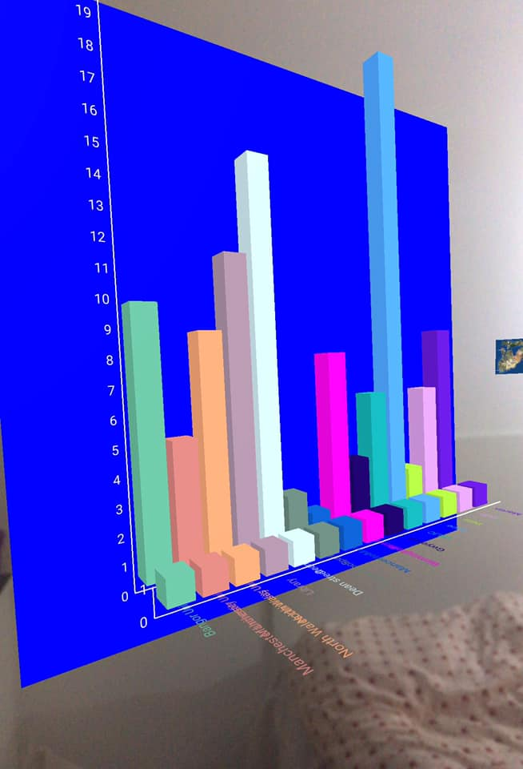

# aframe
A-frame Energy Monitoring Service Bangor University 
This was a dissertation project and the purpose of this was to produce an AR application which will allow users to monitor data in different locations in the real environments. 
This is a location based service which only used A-frame and JavaScript libraries to visualise data in the real environment. 
It did not use any other libraries but used a A-frame component such as, Angle. 
It did not have much libraries which were compitable with AR as A-frame is mostly used for VR.\\ The data is stored in an SVG file. 

This image is used to show how data driven objects display in real life...

This image is used to show how data is stored in a Graph....

\\
This is a web based AR Application so you cannot expect it to work and provide graphics. It works great with a fast internet connection. 
You must allow the Camera and GPS location! If location has not been allowed then it will not be able to track your location and provide accurate data. 

This image is used to show a complete product in the real environment..
 

This application can be used for many other purposes! 
such as for history classes, eductional purposes, business purposes, marketing purpose and much more! 

Please get in touch for business purposes and report any issues! 
azharkhalil@hotmail.co.uk 
